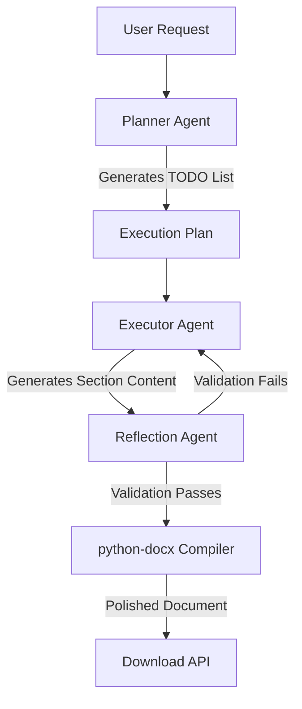

# Product Requirements Document (PRD)
## Autonomous Document Generation AI Agent

**Status:** Proposed  
**Author:** AI Pair-Programming Assistant  
**Date:** July 15, 2026  
**Target Stack:** FastAPI (Backend), Next.js (Frontend), Gemini / Groq / Ollama (LLM Provider), `python-docx` (Document Generation)

---

## 1. Executive Summary & Objectives

### 1.1 Purpose
The purpose of this project is to build an autonomous AI agent system capable of translating complex, natural language business requests into highly polished, structured Microsoft Word (`.docx`) documents. The agent must display autonomous planning, execution of sub-tasks, self-correction, and document styling without manual user intervention during the generation process.

### 1.2 Core Objective
Deliver a full-stack application (FastAPI backend + Next.js frontend) where:
- A user submits a document generation request (e.g., "Write a project proposal for a new mobile app").
- The system generates a structured execution plan (TODO list).
- The agent executes each task in the plan sequentially, generating content.
- The agent performs a self-reflection check to ensure completeness and quality.
- The backend compiles the final output into a styled, professional `.docx` document.
- The user visualizes the agent's progress in real-time and downloads the final file.

---

## 2. User Experience & Frontend Requirements (Next.js)

The frontend should be a highly aesthetic, premium dashboard designed with a dark-mode-first, glassmorphic layout. It must provide clear visual feedback about the agent's internal state.

### 2.1 UI Layout & Design System
- **Theme:** Sleek dark mode using a curated color palette (e.g., Deep Charcoal, Electric Violet, Ocean Cyan, and Amber Gold highlights).
- **Typography:** Premium sans-serif font family (e.g., Inter, Outfit, or Geist) loaded from Google Fonts.
- **Glassmorphism:** Use of blurred overlays, subtle borders, and micro-shadows for container elements.

### 2.2 Core Views & Components
1. **Interactive Prompt Console:**
   - A spacious natural language input field with a glowing focus state.
   - Quick-start preset cards for test cases:
     - *Preset 1 (Standard):* Project Proposal for a clean energy analytics platform.
     - *Preset 2 (Complex):* Technical SOP for DB Migration to AWS Aurora (with ambiguous on-prem servers and downtime limits).
   - "Generate Document" button with a sleek loading spinner.

2. **Real-Time Plan & Execution Stepper:**
   - A visual stepper showing the execution lifecycle:
     - `Planning` $\rightarrow$ `Generating Plan`
     - `Execution` $\rightarrow$ Bulleted checklist of generated sub-tasks (e.g., "Draft Executive Summary", "Compile Technical Specs"). Each item must show status icons: *Pending* (grey), *Processing* (pulsing violet), *Success* (green check), or *Failed* (red cross).
     - `Reflection & Self-Correction` $\rightarrow$ "Verifying requirements..." status.
     - `Compilation` $\rightarrow$ "Compiling Word document..." status.
   - Logs panel: A terminal-like scrolling text area showing stdout/agent logs from the backend.

3. **Document Preview & Download Area:**
   - Once completed, display a file download card with:
     - Document metadata (Title, word count, file size).
     - **Download Button:** Downloads the generated `.docx` file.
     - **Structure Outline:** Interactive list of headings generated in the document.

---

## 3. Backend & API Requirements (FastAPI)

The backend must expose APIs for initiating requests, tracking execution progress, and downloading the compiled document.

### 3.1 API Endpoints

#### 1. Submit Request
* **Endpoint:** `POST /api/agent`
* **Request Body:**
  ```json
  {
    "request": "Write a project proposal for a clean energy analytics platform."
  }
  ```
* **Response Body:**
  ```json
  {
    "task_id": "uuid-123456",
    "status": "queued",
    "message": "Agent execution initiated."
  }
  ```

#### 2. Get Agent Status (Polling or Server-Sent Events)
* **Endpoint:** `GET /api/agent/status/{task_id}`
* **Response Body:**
  ```json
  {
    "task_id": "uuid-123456",
    "status": "processing", // queued, processing, reflection, success, failed
    "current_step": "Executing task 2 of 4: Drafting Project Scope",
    "plan": [
      { "task": "Draft Executive Summary", "status": "completed" },
      { "task": "Draft Project Scope & Deliverables", "status": "processing" },
      { "task": "Create Project Timeline and Resources", "status": "pending" },
      { "task": "Formatting and Final Review", "status": "pending" }
    ],
    "logs": [
      "[INFO] Planner initialized",
      "[INFO] Plan created with 4 sub-tasks",
      "[INFO] Step 1 complete. Proceeding to Step 2."
    ]
  }
  ```

#### 3. Download Document
* **Endpoint:** `GET /api/agent/download/{task_id}`
* **Response:** File stream (`application/vnd.openxmlformats-officedocument.wordprocessingml.document`) downloading the final `.docx` file.

---

## 4. Agent Architecture & Execution Loop

The agent will be built using a **sequential multi-agent pattern** or an **orchestrated single-agent state machine** utilizing a free-tier LLM (e.g., Gemini Flash or Groq Llama 3).



### 4.1 Agent Components
1. **Planner Agent:** 
   - Accepts the user's prompt.
   - Generates a structured list of tasks/chapters to be written (e.g., `["Title & Executive Summary", "System Architecture", "Timeline & Resources"]`).
2. **Executor Agent:**
   - Iterates through the task list.
   - Keeps previous sections in memory as context to prevent hallucinations and maintain flow.
   - Produces raw markdown/structured content for each section.
3. **Reflection & Self-Correction Agent (Engineering Improvement):**
   - Receives the completed document draft.
   - Cross-references the content with the initial user prompt.
   - Checks for quality metrics:
     - Did it cover all constraints?
     - Are there placeholder strings (e.g., `[Insert Date Here]`) left behind?
     - Is the tone appropriate?
   - If issues are detected, compiles a correction plan and passes it back to the Executor.
4. **Document Compiler (`python-docx` Wrapper):**
   - Parses the generated text sections.
   - Applies styling: custom headers/footers, color schemes (primary/secondary), clean table formatting, bold highlights, and page numbers.

---

## 5. Engineering Improvement: Multi-step Planning with Self-Reflection

To satisfy the **One Real Engineering Improvement** requirement, we will implement **Multi-step Planning & Self-Reflection** with automatic retry logic.

### 5.1 Rationale
AI models, when asked to generate long documents in one go, frequently suffer from:
1. Hallucinations or drift.
2. Incomplete coverage of long or ambiguous prompt constraints.
3. Quality degradation towards the end of the text.

By implementing multi-step planning and self-reflection, we break down the writing task into bite-sized segments, monitor progress, check if criteria are met (reflection), and perform micro-adjustments or retries if content does not meet the specified standards.

### 5.2 Implementation Details
- **Step-by-step Execution:** Content is written one chapter/section at a time. The context is passed along as a running summary.
- **Reflection Criteria:** A separate LLM evaluation step verifies the output against:
  - Fulfillment of user constraints.
  - Absence of default placeholders.
  - Logical flow between sections.
- **Retry Mechanism:** Up to 2 retries per section if the evaluator returns a negative score along with specific correction feedback.

---

## 6. Document Styling & Compilation Specifications

The output document must not look like unformatted plain text. The compiler will apply a custom styling sheet to the `.docx` using `python-docx`:

- **Palette:** Navy/Blue theme (Primary: `#1E3A8A` dark blue, Secondary: `#3B82F6` medium blue, Text: `#1F2937` dark grey).
- **Headers & Footers:** A subtle header with the document title and a footer with page numbering.
- **Typography:** Calibri or Arial, sizes:
  - Title: 24pt, Bold, Primary Color
  - Heading 1: 18pt, Bold, Primary Color, with bottom spacing
  - Heading 2: 14pt, Semi-bold, Secondary Color
  - Body Text: 11pt, 1.15 line spacing, 6pt after paragraphs
- **Tables:** Structured tables with primary color backgrounds for header cells and white text, alternating row shading (light grey), and clean cell padding.
- **Callout Boxes:** Left border highlight (thick line in primary color, shaded light blue background) for important notes or quotes.

---

## 7. Verification & Test Scenarios

### 7.1 Test Case 1: Standard Business Request
- **Prompt:** "Draft a Project Proposal for a Clean Energy IoT analytics dashboard. The proposal must include a brief overview, a list of deliverables, project timeline in table format, and cost estimations."
- **Expected Outcome:** A document containing 4 distinct styled sections, a timeline table with correct header styling, and a clean professional layout matching the requested topics.

### 7.2 Test Case 2: Complex / Ambiguous Request
- **Prompt:** "Create a technical SOP for migrating databases from our legacy on-prem PostgreSQL server (version 10, running on CentOS) to AWS Aurora PostgreSQL Serverless. The system serves 5,000 active users. We don't have the exact network topology documentation, but security is highly strict and we cannot tolerate more than 30 minutes of downtime. We need fallback steps if the migration fails."
- **Expected Outcome:** 
  - The planner must recognize the ambiguous items (e.g., missing network topology) and note assumptions explicitly in the document under an "Assumptions & Pre-requisites" section.
  - Detailed steps for active-passive database migration under 30 minutes (e.g., using AWS DMS with ongoing replication or pg_dump/pg_restore with strict maintenance windows).
  - Explicit rollback and contingency plan sections.

---

## 8. Success Criteria

1. **Autonomous Operation:** The agent should run end-to-end, moving from request to final document, without freezing, crashing, or requiring user input.
2. **Document Professionalism:** The resulting `.docx` must compile successfully, open in MS Word/LibreOffice without errors, and look visual, clean, and styled.
3. **UI Fidelity:** The Next.js dashboard must be responsive, visually stunning (confirming to the high-aesthetic guidelines), and accurately show backend logs and stepper states.
4. **Performance:** Standard generation takes less than 60 seconds; complex generation takes less than 120 seconds.
